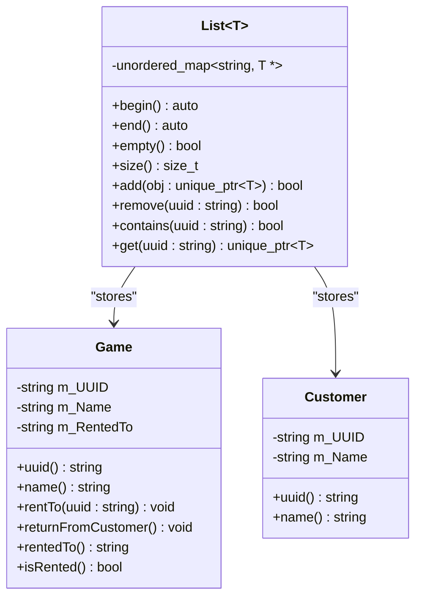

Hey there! I’m building a tool to help me run my local board game café.
I need something lightweight—just something I can use to keep track of the different
board games we have, who’s borrowing them, and when they’re due back.

Ideally, I’d like to be able to:

    See a LIST of all the GAMES we have, along with how many COPIES are AVAILABLE.
    CHECK OUT a game to a CUSTOMER and see WHO has what.
    TRACK when games are RETURNED.

Nothing too fancy, but something I could actually use to run the lending part of the shop.
Let me know what you can come up with!


# 1. Translate the ask into a clear specification
* Rephrase the customer's request into a clean program specification (3-5 sentences)
* Make sure your spec contains:
  * What the program does
  * What entities are involved
  * What functionality it provides

##################
* Tool to run local board game cafe
  * See a list of all the games he has (as well as available copies)
  * Check out a game to a customer and keep track of who currently has which game
  * Track game returns
##################

# 2. Identify nouns and verbs
* In design.md, make a list of:
  * Key nouns -> likely candidates for classes or attributes
  * Key verbs -> likely candidates for methods or behaviors

##################
Key nouns/adjectives: List, games, copies, customer, available
Key verbs: 'Check out' (not a verb, but it works in this context), track, returned
##################

# 3. Design at least 2-3 classes
* Based on your spec, design at least 2-3 C++ classes. Include:
  * Class names
  * Public attributes and method headers only (no implementation)
  * Proper visibility (public, private) where appropriate
* Use C++-style class definitions in your Markdown file—refer to the formatting in the Pet Tracker
example from your “Using Mermaid” document. Use the triple backticks to make code look good in markdown.

##################
# Classes:

class Game {
    std::string m_UUID {};
    std::string m_Name {};
    std::optional<std::string> m_RentedTo {};
    
public:
    Game() = default;
    ~Game() = default;
    const std::string &uuid() const { return m_UUID; }
    const std::string &name() const { return m_Name; }
    
    void rentTo(const std::string &customerUUID) { m_RentedTo = customerUUID; }
    void returnFromCustomer() { m_RentedTo.reset(); }
    std::optional<std::string> rentedTo() const { return m_RentedTo; }
    bool isRented() const { return m_RentedTo.has_value(); }
};

template <typename T>
class List {
    std::unordered_map<std::string, std::unique_ptr<T>> m_Objects;

public:
    List() = default;

    ~List() = default;
    auto begin() const { return m_Objects.begin(); }
    auto end() const { return m_Objects.end(); }
    bool empty() const { return m_Objects.empty(); }
    std::size_t size() const { return m_Objects.size(); }

    bool add(std::unique_ptr<T> &obj)
    {
        const auto &uuid = obj->uuid();
        auto [it, inserted] = m_Objects.emplace(uuid, std::move(obj));
        return inserted;
    }

    bool remove(const std::string &uuid)
    {
        return m_Objects.erase(uuid) > 0;
    }
    
    bool contains(const std::string &uuid)
    {
        return m_Objects.find(uuid) != m_Objects.end();
    }

    std::unique_ptr<T> get(const std::string &uuid)
    {
        auto it = m_Objects.find(uuid);
        if (it == m_Objects.end()) return nullptr;
        std::unique_ptr<T> ptr = std::move(it->second);
        m_Objects.erase(it);
        return ptr;
    }
};

class Customer {
    std::string m_UUID {};
    std::string m_Name {};    

public:
    Customer() = default;
    ~Customer() = default;
    const std::string &uuid() const { return m_UUID; }
    const std::string &name() const { return m_Name; }
};

##################

# 4. Draw a class diagram using Mermaid
* At the end of design.md, create a Mermaid class diagram that:
  * Shows your class names
  * Lists public attributes and method signatures
  * Shows relationships between classes (e.g. "has a", "uses", "inherits from"
  * Use GitHub-flavored Markdown syntax for the diagram (```mermaid```).

