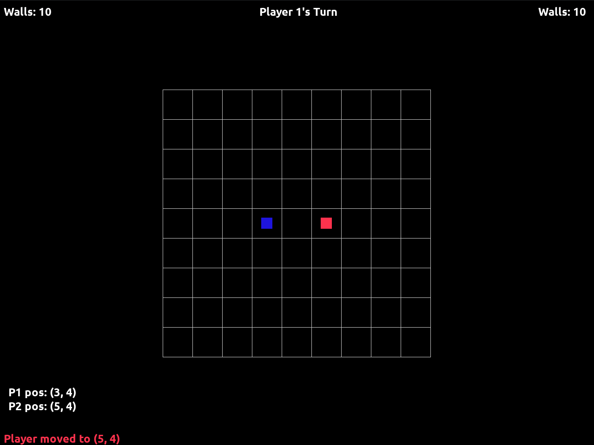

# Project 04 - Quoridor
**Quoridor** is a two-player turn-based strategy game implemented in C++ using SDL2. Each player must navigate their pawn from one side of a 9x9 grid to the opposite side, while using a limited number of walls to strategically block their opponent.

## 🎮 Controls
| Key            | Action                       |
|----------------|------------------------------|
| Mouse          | Move player                  |
| **J** + Arrows | Jump opponent (move 2 cells) 
| `r`            | Show rules                   |
| `f`            | Forfeit game                 |

## Screenshot:


_Note: This codebase is not complete. Placing walls and some of the game's core logic is not yet implemented._

## Prerequisites:
Ensure you have the latest version of SDL2 and CMake installed.

## Building
You must first have CMake installed as your build system to compile.

### On Linux:
1. Clone the repository:
```bash
git clonehttps://github.com/mykalsullivan/cpsc2376-sullivan.git
```
2. Navigate to the project folder and build directory:
```bash
cd projects/project04/
mkdir build && cd build
```
3. Run CMake to generate the build files, then build the project:\
```
cmake -S .
make
```

### Windows:
Building on Windows should be similar to Linux. I don't have a way to test it as of right now, so you may be on your own for now...

## Changelog:
_This will be updated in the near future!_